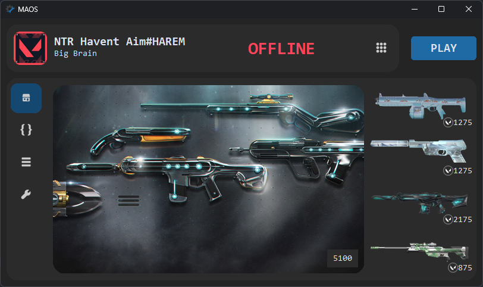
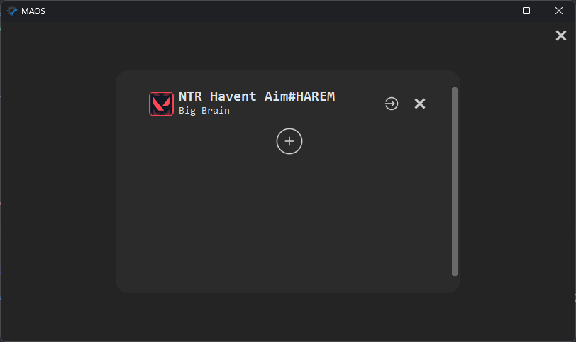

# MAOS
Python Valorant Third-party Launcher

MCOS: Multi-account one setting

## About:
When you have multiple accounts and share them with your friends, your accounts will become chaotic. You won't know which account is currently in use, and when you log in. You may spend a lot of time adjusting your settings. It is really annoying. So, I created this launcher to have full control over these accounts.

## Features:
- Account Switcher
- Centralize a game setting
  - Set your settings when you play
  - Set them back when you quit the game
- Match history (developing)
- Account status 
  - Check if your friend is currently in use
- Quick access:
  - shortcut of each account

## Install

## Running from source:
1. Install Python >= 3.7 
2. Download the source
3. Open a terminal within the source folder.
4. install library  
  `pip install -r requirements.txt`
5. run app  
  `python MAOS.py`

## Compiling from source:
1. `pip install pyinstaller`
2. `python buid.py`  
>see more at https://pyinstaller.org/en/stable/

## Screenshort:

## Acknowledgements:
 - [valorant-API](https://valorant-api.com)
 - [ValLib](https://github.com/ValUtils/ValLib)
 - [valorant-api-docs](https://github.com/techchrism/valorant-api-docs)

## Disclaimer

 THIS PROJECT IS NOT ASSOCIATED OR ENDORSED BY RIOT GAMES. Riot Games, and all associated properties are trademarks or registered trademarks of Riot Games, Inc.
    
 Whilst effort has been made to abide by Riot's API rules; you acknowledge that use of this software is done so at your own risk.
